# E-commerce 微服务架构设计

> 一个完整的电子商务微服务架构，包含前端、API Gateway、认证层和多个后端微服务

---

## 目录

- [架构总览](#架构总览)
- [详细架构图](#详细架构图)
- [认证流程](#认证流程)
- [服务间通信](#服务间通信)
- [数据流向](#数据流向)
- [技术选型详解](#技术选型详解)
- [部署架构](#部署架构)

---

## 架构总览

```mermaid
flowchart TB
    subgraph clients [Client Layer - 前端层]
        WebApp["🌐 Web App<br/>Next.js 14 + React 18"]
        MobileApp["📱 Mobile App<br/>React Native"]
        AdminPanel["⚙️ Admin Panel<br/>Vue.js 3 + Element Plus"]
    end

    subgraph gateway [API Gateway Layer - 网关层]
        Kong["Kong API Gateway"]
        RateLimiter["Rate Limiter<br/>请求限流"]
        LoadBalancer["Load Balancer<br/>负载均衡"]
        RequestLog["Request Logger<br/>请求日志"]
    end

    subgraph auth [Authentication Layer - 认证层]
        Keycloak["Keycloak<br/>Identity Provider"]
        JWTValidator["JWT Validator<br/>Token 验证"]
        OAuth["OAuth 2.0 / OIDC<br/>认证协议"]
    end

    subgraph core [Core Business Services - 核心业务服务]
        UserSvc["👤 User Service<br/>Node.js + Express"]
        ProductSvc["📦 Product Service<br/>Java + Spring Boot"]
        OrderSvc["🛒 Order Service<br/>Java + Spring Boot"]
        PaymentSvc["💳 Payment Service<br/>Go + Gin"]
        InventorySvc["📊 Inventory Service<br/>Go + Gin"]
    end

    subgraph extended [Extended Services - 扩展服务]
        CartSvc["🛍️ Cart Service<br/>Node.js + Redis"]
        ReviewSvc["⭐ Review Service<br/>Python + FastAPI"]
        SearchSvc["🔍 Search Service<br/>Elasticsearch"]
        NotificationSvc["📧 Notification Service<br/>Node.js"]
        RecommendSvc["🎯 Recommendation Service<br/>Python + ML"]
    end

    subgraph messaging [Message Queue - 消息队列]
        Kafka["Apache Kafka<br/>Event Streaming"]
        RabbitMQ["RabbitMQ<br/>Task Queue"]
    end

    subgraph data [Data Layer - 数据层]
        PostgreSQL[(PostgreSQL<br/>主数据库)]
        MongoDB[(MongoDB<br/>文档数据库)]
        Redis[(Redis<br/>缓存)]
        ES[(Elasticsearch<br/>搜索引擎)]
    end

    subgraph infra [Infrastructure - 基础设施]
        Consul["Consul<br/>Service Discovery"]
        Prometheus["Prometheus<br/>Monitoring"]
        Grafana["Grafana<br/>Dashboard"]
        Jaeger["Jaeger<br/>Distributed Tracing"]
        K8s["Kubernetes<br/>Container Orchestration"]
    end

    %% Client to Gateway
    clients --> Kong
    
    %% Gateway to Auth
    Kong <--> Keycloak
    Keycloak --> JWTValidator
    JWTValidator --> OAuth
    
    %% Gateway to Services
    Kong --> core
    Kong --> extended
    
    %% Core Services to Data
    UserSvc --> PostgreSQL
    ProductSvc --> PostgreSQL
    OrderSvc --> PostgreSQL
    PaymentSvc --> PostgreSQL
    InventorySvc --> PostgreSQL
    
    %% Extended Services to Data
    CartSvc --> Redis
    ReviewSvc --> MongoDB
    SearchSvc --> ES
    NotificationSvc --> RabbitMQ
    RecommendSvc --> MongoDB
    
    %% Services to Messaging
    core --> Kafka
    extended --> Kafka
    
    %% Services to Cache
    ProductSvc --> Redis
    InventorySvc --> Redis
    
    %% Services to Infrastructure
    core --> Consul
    extended --> Consul
    core --> Prometheus
    extended --> Prometheus
```

---

## 详细架构图

### 分层架构视图

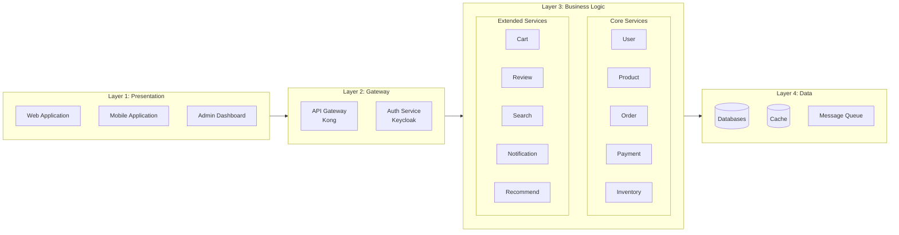

---

## 认证流程

### 用户登录流程

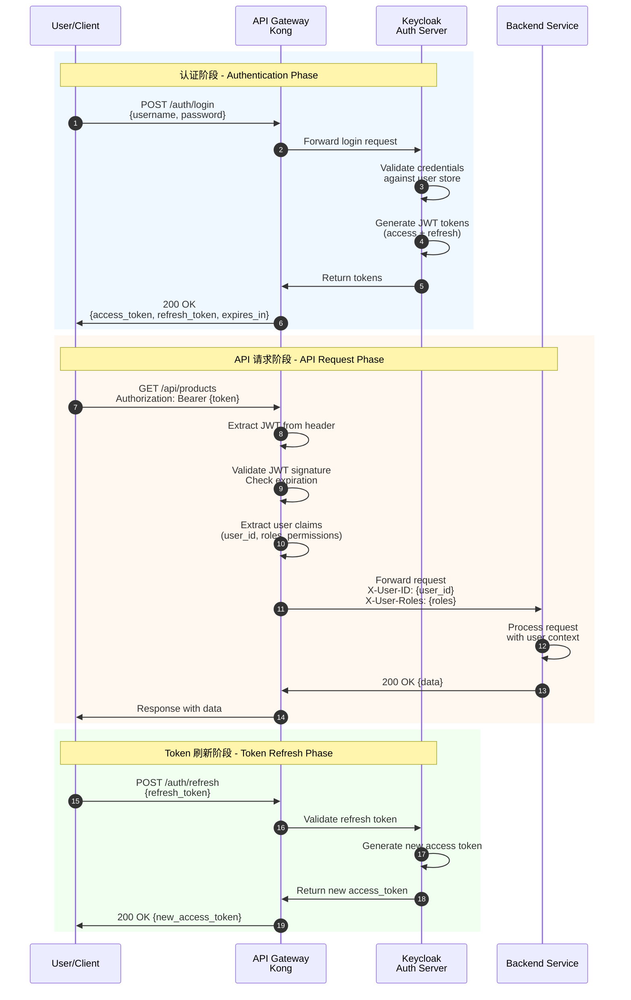

### OAuth 2.0 授权码流程

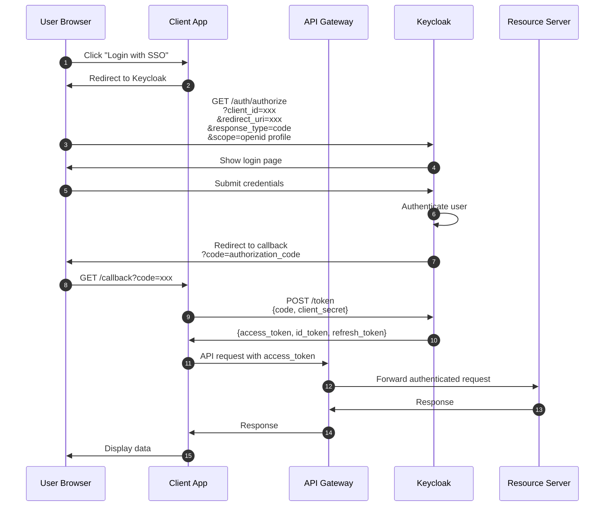

---

## 服务间通信

### 同步通信 (REST/gRPC)

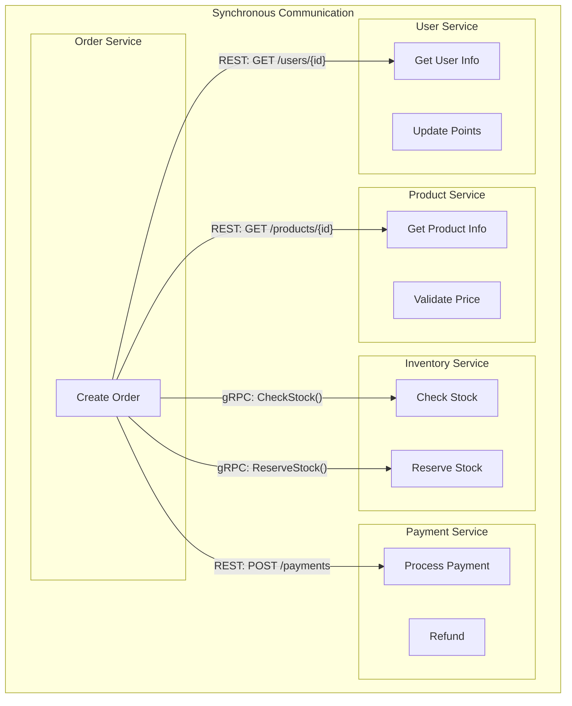

### 异步通信 (Event-Driven)

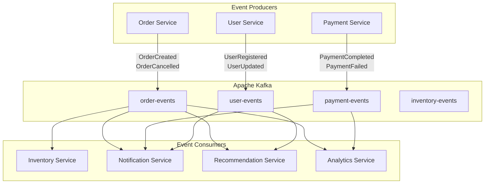

### 事件驱动订单流程

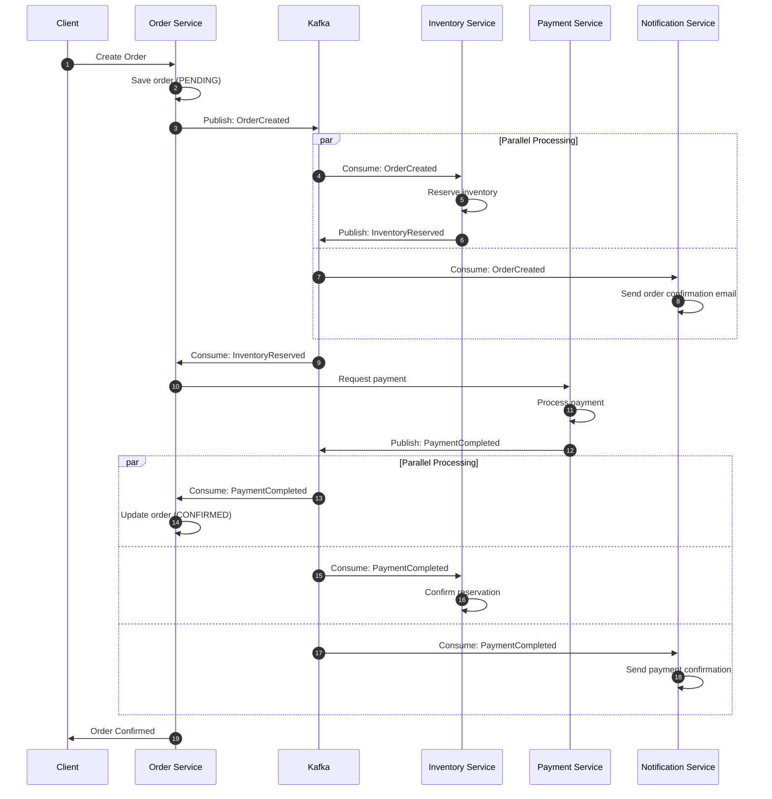

---

## 数据流向

### 核心业务数据流

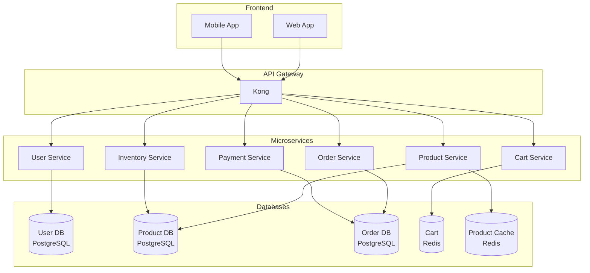

### 搜索与推荐数据流

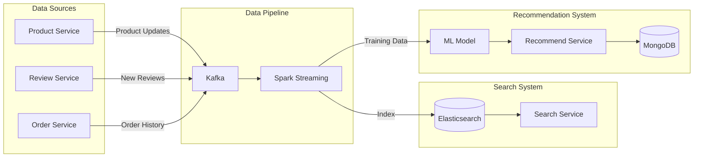

---

## 技术选型详解

### 1. 前端层 (Client Layer)

| 组件 | 技术选型 | 版本 | 说明 |
|------|----------|------|------|
| Web Application | Next.js | 14.x | SSR/SSG 支持，SEO 友好，React Server Components |
| Mobile Application | React Native | 0.73+ | 跨平台移动应用，代码复用率高 |
| Admin Dashboard | Vue.js 3 + Element Plus | 3.4+ | 响应式后台管理，丰富的组件库 |
| State Management | Zustand / Pinia | Latest | 轻量级状态管理 |
| API Client | Axios / TanStack Query | Latest | HTTP 请求，缓存，重试机制 |

### 2. API Gateway 层

| 组件 | 技术选型 | 说明 |
|------|----------|------|
| API Gateway | Kong | 高性能，插件丰富，支持 gRPC |
| Rate Limiting | Kong Rate Limiting Plugin | 请求限流，保护后端服务 |
| Authentication | Kong JWT Plugin | JWT 验证，与 Keycloak 集成 |
| Load Balancing | Kong Upstream | 负载均衡，健康检查 |
| Logging | Kong File Log / HTTP Log | 请求日志，审计追踪 |
| CORS | Kong CORS Plugin | 跨域资源共享配置 |

### 3. 认证层 (Authentication Layer)

| 组件 | 技术选型 | 说明 |
|------|----------|------|
| Identity Provider | Keycloak 23.x | 开源身份认证管理，企业级功能 |
| Token Format | JWT (RS256) | 非对称加密，无状态认证 |
| Protocol | OAuth 2.0 + OIDC | 行业标准认证协议 |
| MFA | Keycloak OTP | 多因素认证支持 |
| SSO | Keycloak Realm | 单点登录 |

### 4. 核心业务服务

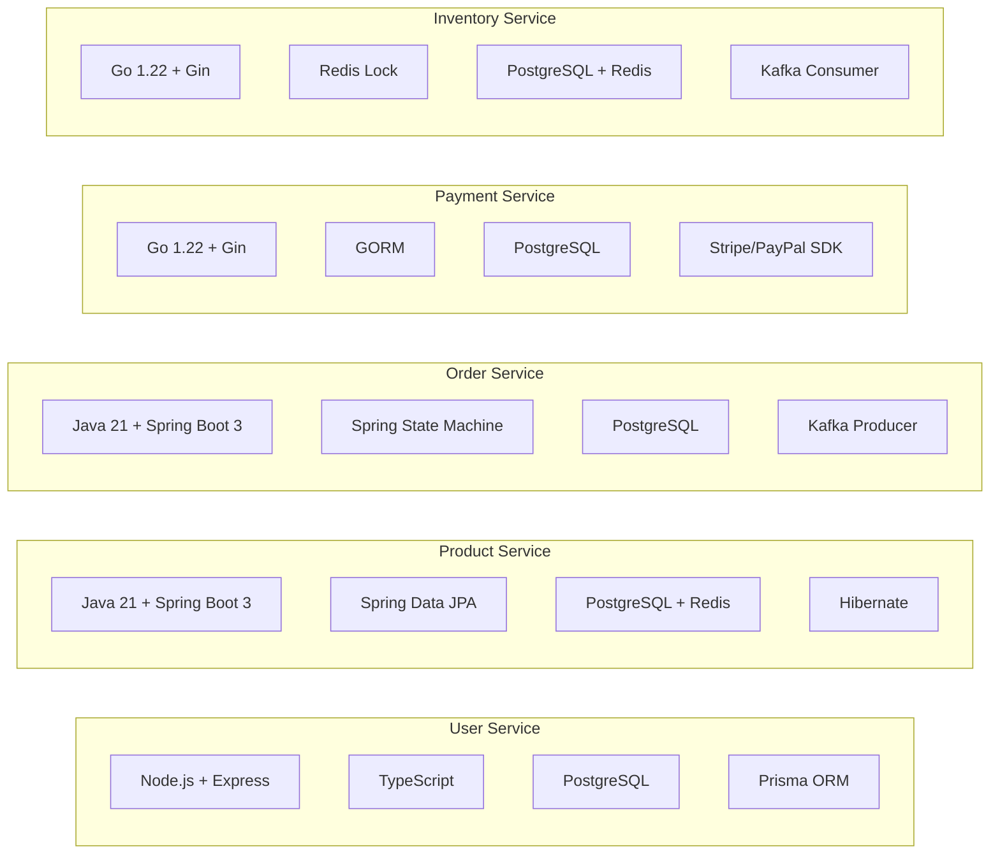

| 服务 | 技术栈 | 数据库 | 主要职责 |
|------|--------|--------|----------|
| User Service | Node.js + Express + TypeScript | PostgreSQL | 用户注册、认证、Profile管理、地址管理 |
| Product Service | Java 21 + Spring Boot 3 | PostgreSQL + Redis | 商品 CRUD、分类管理、SKU管理、价格管理 |
| Order Service | Java 21 + Spring Boot 3 | PostgreSQL | 订单创建、状态机管理、订单查询 |
| Payment Service | Go 1.22 + Gin | PostgreSQL | 支付集成(Stripe/PayPal)、退款处理、账单管理 |
| Inventory Service | Go 1.22 + Gin | PostgreSQL + Redis | 库存管理、库存锁定、库存预警 |

### 5. 扩展服务

| 服务 | 技术栈 | 数据存储 | 主要职责 |
|------|--------|----------|----------|
| Cart Service | Node.js + Express | Redis | 购物车 CRUD、合并、过期处理 |
| Review Service | Python + FastAPI | MongoDB | 商品评价、评分统计、图片评论 |
| Search Service | Java + Spring Boot | Elasticsearch | 全文搜索、筛选、聚合、自动补全 |
| Notification Service | Node.js + Bull | Redis + RabbitMQ | 邮件、短信、App Push、站内信 |
| Recommendation Service | Python + FastAPI | MongoDB + Redis | 协同过滤、基于内容推荐、实时推荐 |

### 6. 数据层

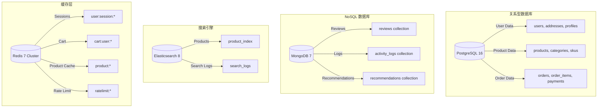

### 7. 消息队列

| 组件 | 技术选型 | 使用场景 |
|------|----------|----------|
| Event Streaming | Apache Kafka | 订单事件、库存事件、用户行为事件 |
| Task Queue | RabbitMQ | 邮件发送、短信发送、异步任务 |
| Delayed Queue | RabbitMQ Dead Letter | 订单超时取消、定时任务 |

### 8. 基础设施

| 组件 | 技术选型 | 用途 |
|------|----------|------|
| Container | Docker | 应用容器化 |
| Orchestration | Kubernetes (K8s) | 容器编排、自动伸缩、滚动更新 |
| Service Mesh | Istio (可选) | 服务间通信、流量管理 |
| Service Discovery | Consul | 服务注册与发现、健康检查 |
| Configuration | Consul KV / Spring Cloud Config | 集中配置管理 |
| Monitoring | Prometheus + Grafana | 指标收集、可视化监控 |
| Logging | ELK Stack (Elasticsearch + Logstash + Kibana) | 日志聚合与分析 |
| Tracing | Jaeger | 分布式追踪、性能分析 |
| CI/CD | GitLab CI / GitHub Actions | 自动化构建、测试、部署 |
| Secret Management | HashiCorp Vault | 密钥管理、证书管理 |

---

## 部署架构

### Kubernetes 部署架构

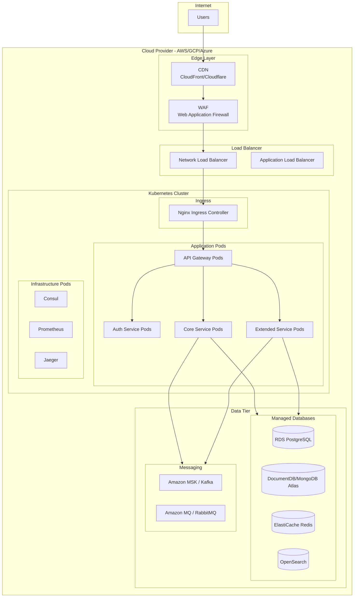

### 多环境部署

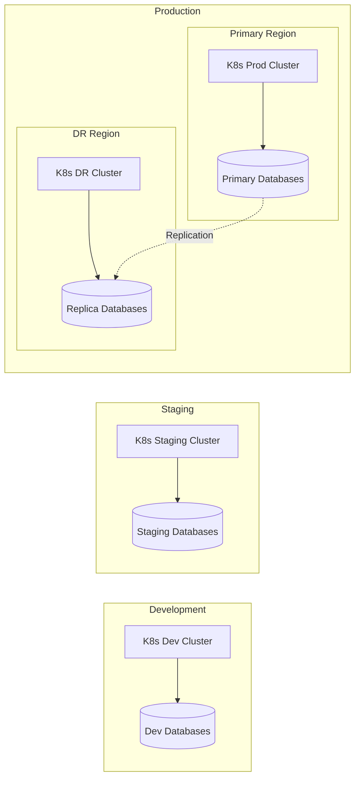

---

## API 端点设计

### 主要 API 路由

| 服务 | 端点 | 方法 | 说明 |
|------|------|------|------|
| **Auth** | `/auth/login` | POST | 用户登录 |
| | `/auth/register` | POST | 用户注册 |
| | `/auth/refresh` | POST | 刷新 Token |
| | `/auth/logout` | POST | 用户登出 |
| **User** | `/api/v1/users/me` | GET | 获取当前用户信息 |
| | `/api/v1/users/me/addresses` | GET/POST | 地址管理 |
| **Product** | `/api/v1/products` | GET | 商品列表 |
| | `/api/v1/products/{id}` | GET | 商品详情 |
| | `/api/v1/categories` | GET | 分类列表 |
| **Cart** | `/api/v1/cart` | GET | 获取购物车 |
| | `/api/v1/cart/items` | POST/PUT/DELETE | 购物车操作 |
| **Order** | `/api/v1/orders` | GET/POST | 订单列表/创建 |
| | `/api/v1/orders/{id}` | GET | 订单详情 |
| | `/api/v1/orders/{id}/cancel` | POST | 取消订单 |
| **Payment** | `/api/v1/payments` | POST | 创建支付 |
| | `/api/v1/payments/{id}/status` | GET | 支付状态 |
| **Search** | `/api/v1/search` | GET | 商品搜索 |
| | `/api/v1/search/suggestions` | GET | 搜索建议 |
| **Review** | `/api/v1/products/{id}/reviews` | GET/POST | 商品评论 |
| **Notification** | `/api/v1/notifications` | GET | 通知列表 |

---

## 安全考虑

### 安全架构

```mermaid
flowchart TB
    subgraph security [Security Layers]
        subgraph network [Network Security]
            WAF[WAF<br/>SQL Injection, XSS Protection]
            DDoS[DDoS Protection]
            TLS[TLS 1.3<br/>Encryption in Transit]
        end
        
        subgraph app [Application Security]
            JWT[JWT Authentication]
            RBAC[RBAC Authorization]
            RateLimit[Rate Limiting]
            InputValidation[Input Validation]
        end
        
        subgraph data_sec [Data Security]
            Encryption[Encryption at Rest<br/>AES-256]
            Vault[HashiCorp Vault<br/>Secrets Management]
            Backup[Encrypted Backups]
        end
        
        subgraph audit [Audit & Compliance]
            AuditLog[Audit Logging]
            SIEM[SIEM Integration]
            Compliance[PCI-DSS, GDPR]
        end
    end
    
    network --> app
    app --> data_sec
    data_sec --> audit
```

---

## 监控与告警

### 监控指标

| 类别 | 指标 | 告警阈值 |
|------|------|----------|
| **应用** | 请求延迟 P99 | > 500ms |
| | 错误率 | > 1% |
| | 请求吞吐量 | 突变 > 50% |
| **基础设施** | CPU 使用率 | > 80% |
| | 内存使用率 | > 85% |
| | 磁盘使用率 | > 90% |
| **业务** | 订单创建失败率 | > 0.5% |
| | 支付成功率 | < 98% |
| | 库存扣减失败 | 任意失败 |

---

## 总结

本架构设计遵循以下原则：

1. **高可用性**: 服务无状态化、多副本部署、跨区域容灾
2. **可扩展性**: 微服务独立扩展、消息队列解耦、缓存层加速
3. **安全性**: 零信任架构、端到端加密、细粒度权限控制
4. **可观测性**: 统一日志、分布式追踪、实时监控告警
5. **开发效率**: API Gateway 统一入口、服务自治、CI/CD 自动化

---

*Generated for E-commerce Microservice Architecture*

